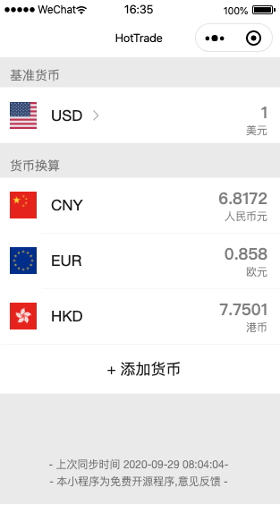

# 微信小程序hottrade(汇率计算器)开源

-- 20201013 跟新
1. 增加google chrome 插件版本
2. 完善产品描述

--
Hot Trade 是一款设计风格简洁开源汇率计算器，设计的初衷是为了学习前端的开发。
你可以选择一个基准货币并选择你关注的其他货币进行计算，由于三方APIs的问题国际汇率的同步时间为每天上午9:00 UTC+8时区。
目前支持52个的地区的汇率计算，如下所示

Hot Trade is a clear style exchange rate calculator, chose a base currency then chose the favorite your want others and calculate, due to apis issues the international exchange rate sync time at 9:00 AM UTC+8 timezone per day.
Support the exchange rate calculation of 52 regions, as below

AED	UAE Dirham	阿联酋迪拉姆

ARS	Argentine Peso	阿根廷比绍

AUD	Australian Dollar	澳大利亚元

BGN	Bulgarian Lev	保加利亚列弗

BRL	Brazilian Real	巴西雷亚尔

BSD	Bahamian Dollar	巴哈马元

CAD	Canadian Dollar	加拿大元

CHF	Swiss Franc	瑞士法郎

CLP	Chilean Peso	智力比绍

CNY	Chinese Yuan	人民币元

COP	Colombian Peso	哥伦比亚比绍

CZK	Czech Koruna	捷克克朗

DKK	Danish Krone	丹麦克朗

DOP	Dominican Peso	多米尼亚比绍

EGP	Egyptain Pound	埃及镑

EUR	Euro	欧元

FJD	Fiji Dollar	斐济元

GBP	British Pound	英镑

GTQ	Guatemala Quetzal	危地马拉格查尔

HKD	Hongkong Dollar	港币

HRK	Croatian Kuna	克罗地亚库纳

HUF	Hungarian Forint	匈牙利福林

IDR	Indonesian Rupiah	印度尼西亚卢比

ILS	Israeli Shekel	以色列新克尔

INR	Indian Rupee	印度卢比

ISK	Iceland Krona	冰岛克朗

JPY	Japanese Yen	日元

KRW	South Korean Won	韩元

KZT	Kazakhstan Tenge	哈克斯坦腾格

MVR	Maldives Rufiyaa	马尔代夫拉菲亚

MXN	Mexican Peso	墨西哥比绍

MYR	Malaysian Ringgit	马来西亚林吉特

NOK	Norwegian Korne	挪威克朗

NZD	New Zealand Dollar	新西兰元

PAB	Panama Ballboa	巴拿马巴波亚

PEN	Peruvian Nuevo Sol	秘鲁新索尔

PHP	Philippine Peso	菲律宾比索

PKR	Pakistani Rupee	巴基斯坦卢比

PLN	Polish Zloty	波兰兹罗提

PYG	Paraguayan Guarani	巴拉圭瓜拉尼

RON	Romanian New Leu	罗马尼亚新列伊

RUB	Russian Rouble	俄罗斯卢比

SAR	Saudi Arabian Riyal	沙特阿拉伯亚尔

SEK	Swedish Krona	瑞典克朗

SGD	Singapore Dollar	新加坡元

THB	Thai Baht	泰铢

TRY	Turkish Lira	土耳其里拉

TWD	Taiwan Dollar	新台币

UAH	Ukraine Hryvnia	乌克兰格里夫纳

USD	United States Dollar	美元

UYU	Uruguayan New Peso	乌拉圭新比绍

ZAR	South African Rand	南非兰特

--- init

python 和 前段 都是刚刚开始学习的，代码有点拙劣，以后再慢慢完善的把。

服务器端采用 python + Django

客户端为原生微信小程序，使用微信官方UI控件库

微信扫描

微信小程序预览

chrome插件预览

